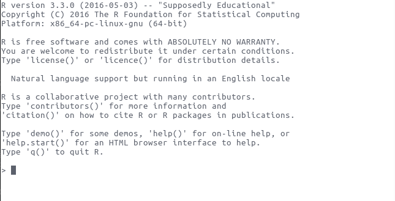

```{r, include = FALSE}
library(ggplot2)
```

###
\centering


# What is R?
### R is a computer programming language
\centering


## Intro
### What is R? 
* R is a language and environment for statistical computing and
  graphics.
* Derived from S, designed at Bell Laboratories
    + S first appeared in 1976!
* Full language, but flexible and (can be) simple

### 
```{r}
mtcars
```

###
```{r}
mean(mtcars$mpg)
summary(mtcars$mpg)
table(mtcars$cyl)
```

###
```{r, fig.height = 5}
ggplot(mtcars, aes(wt, mpg)) + geom_point()
```

### Advantages of R
* It's free, open-source, and available on nearly every platform
    + Stata, the main competitor with R in our department, is between
      $55/year and $235/year for students, depending on what you need
* Unparalleled in the number of  packages (groups of
  functions)
  + More than 8,500 packages on CRAN as of June 2016, 
* Great community help (e.g. #rstats on twitter, stackoverflow.com, R-bloggers)
* You can combine documents and r code together (rmarkdown or knitr)
    + For example, this presentation is written in rmarkdown

### R Editors
* No one likes using R in a terminal, so everyone uses an editor
* Most popular is probably RStudio
* Emacs with ESS also very good choice

### RStudio Layout 
* Bottom left: Console
    + This is where you can enter R code to execute
* Top left: editor window
    + You can have open R scripts or rmarkdown files here to edit
* Top right: environment, history, (git)
    + Environment will list everything that R is "remembering"
    + History lists all commands entered in that "project"
* Bottom right: files, plots, packages, help

### R Projects
* You can set up different "projects" from within Rstudio
* This will automatically change the working directory to where you put the project
* I use a project for each paper, for example

### Working directory
* What is a directory?
* What is a working directory?
* Run `getwd()` in R. What does it return?
    + This is where R will save/load files from 

# Using R
## The basics 
### Calculator 
R is a great calculator 

```{r}
3 + 2
1.7729 ^ 4 * (1930 / 4)
```

### Algebra & functions
R can do algebra and functions
```{r}
a <- 1
b <- 2
a + b
A <- 3
a + b - A
factorial(3)
```

### You try!
What will be the output of:
```{r, eval = FALSE}
round(round(2.391) + 7.21)
```

### Assignment
R uses ` <- ` for assignment. 

```{r}
a <- 4
a + 7
a <- a + 2
a + 7
```

`a` is now referred to as an "object." Pretty much anything R
remembers is an object. 

### Functions
Functions take arguments

```{r}
myvector <- c(1, 5, 2, 7, 9, NA, 1)
mean(myvector, na.rm = TRUE)
```

```{r, eval=FALSE}
?rnorm
rnorm(5, 0, 1)
```
# Scalars, vectors, and matrices 
## Scalar, vectors, and matrices
### Scalars

```{r}
12
```

### Vectors
Created with `c` (create) function:
```{r}
c(1, 4, 2, -1)
```

### Matrices 
created with the `matrix` function:
```{r}
matrix(c(1, 2, 3, 4, 2, 1), nrow = 3)
```

# Data Types
## Data types
### You try! 
What kinds of data exist here?
```{r}
head(mtcars)
```

### Basic Data Structures
We'll talk about four kinds of data

### Logical
Something that is (TRUE) or isn't (FALSE)

```{r}
4 == 6
class(TRUE)
```

### Numeric
A number
```{r}
class(7.12)
a <- 2.192
class(a)
```

### Character
Character data is R's way of remembering letters

```{r}
"My name is Alex"
class("3.218")
class("TRUE")
```

### Factor

Factors are R's way of remembering categories and labels

```{r}
myfactor <- factor(c("a", "b", "c", "c", "b", "A"))
myfactor
```

### You try!
What class are the following:

```
x <- 3.18

"x"
x
```

Make a vector that contains a number, a letter, and FALSE. What's the
class of the vector?

### Coercion 

* Anything can get coerced to a character
* Coercing logical to numeric means TRUE = 1, FALSE = 0

### You try
What type will result:

```
c(5, "a")
c(TRUE, "FALSE")
TRUE + 7
```

### Matrices 
A matrix can have only one data type:

```{r}
matrix(c(1, 2, 3, "a", "b", "c", TRUE, FALSE, TRUE), ncol = 3)
```

## Lists and data frames
### Lists and data frames
Lists and data frames allow for multiple data types

### lists
A list is a one-dimensional group of objects:

```{r}
mylist <- list(1, "r", FALSE)
class(mylist)
length(mylist)
```

### Lists
Elements in a list can be anything - including vectors and lists:

```{r}
list(c(1, 2, 3), TRUE, list(c(4, 5, 6), FALSE))
```

### data.frame

```{r}
mydata <- data.frame(x = c(1, 2, 3), y = c(5, 11, 4), 
                     z = c("some", "fancy", "text"))
mydata
```

###

```{r}
mean(mydata$x)
mean(mydata[, 1])
mean(mydata[, "x"])
```

## Types and dimensions
### Types and Dimensions

|    | Single type | Multiple types |
|----+-------------+----------------|
| 1D | Vector      | List           |
| 2D | Matrix      | Data frame     |
| nD | Array       |                |

# Packages
### Packages 
* Packages extend R's functionality
* CRAN hosts many packages and R can install packages from CRAN
  easily:
  
```{r, eval = FALSE}
install.packages("ggplot2")
```
