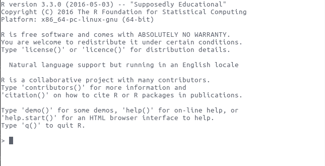

```{r, include=FALSE}
library(ggplot2)
library(rio)
```

###


# What is R?
### R is a computer programming language


## Intro
### What is R? 
* R is a language and environment for statistical computing and
  graphics.
* Derived from S, designed at Bell Laboratories
    + S first appeared in 1976!
* Full language, but flexible and (can be) simple

### 
```{r}
mtcars
```

###
```{r}
mean(mtcars$mpg)
summary(mtcars$mpg)
table(mtcars$cyl)
```

###
```{r, fig.height = 5}
ggplot(mtcars, aes(wt, mpg)) + geom_point()
```

### Advantages of R
* It's free, open-source, and available on nearly every platform
    + Stata is between $55/year and $235/year for students, depending on what you need 
* Unparalleled in the number of  packages (groups of
  functions)
  + More than 8,500 packages on CRAN as of June 2016, 
* Great community help (e.g. #rstats on twitter, stackoverflow.com, R-bloggers)
* You can combine documents and r code together (rmarkdown or knitr)
    + For example, this presentation is written in rmarkdown

### R Editors
* No one likes using R in a terminal, so everyone uses an editor
* Most popular is probably RStudio
* Emacs with ESS also very good choice

### RStudio Layout 
* Bottom left: Console
    + This is where you can enter R code to execute
* Top left: editor window
    + You can have open R scripts or rmarkdown files here to edit
* Top right: environment, history, (git)
    + Environment will list everything that R is "remembering"
    + History lists all commands entered in that "project"
* Bottom right: files, plots, packages, help

### R Projects
* You can set up different "projects" from within Rstudio
* This will automatically change the working directory to where you put the project
* I use a project for each paper, for example

# Using R
## The basics 
### Calculator 
R is a great calculator 

```{r}
3 + 2
1.7729 ^ 4 * (1930 / 4)
```

### Algebra & functions
R can do algebra and functions
```{r}
a <- 1
b <- 2
a + b
A <- 3
a + b - A
factorial(3)
```

### You try!
What will be the output of:
```{r, eval = FALSE}
round(round(2.391) + 7.21)
```

### Assignment
R uses ` <- ` for assignment. 

```{r}
a <- 4
a + 7
a <- a + 2
a + 7
```

`a` is now referred to as an "object." Pretty much anything R
remembers is an object. 

### Functions
Functions take arguments

```{r}
myvector <- c(1, 5, 2, 7, 9, NA, 1)
mean(myvector, na.rm = TRUE)
```

```{r, eval=FALSE}
?rnorm
rnorm(5, 0, 1)
```
# Data structures
## Scalar, vectors, and matricies
### Scalars

```{r}
12
```

### Vectors
Created with `c` (create) function:
```{r}
c(1, 4, 2, -1)
```

### Matricies
created with the `matrix` function:
```{r}
matrix(c(1, 2, 3, 4, 2, 1), nrow = 3)
```

## Data Structures
### You try! 
What kinds of data exist here?
```{r}
head(mtcars)
```

### Basic Data Structures
We'll talk about four kinds of data
```{r, eval = FALSE}
TRUE ; FALSE
3.27
3L
"character"
```


### matrix

```{r}
mymatrix <- matrix(c(1, 2, 3, 5, 11, 4), nrow = 2, byrow = TRUE)
mymatrix
mean(mymatrix[, 1])
```

### data.frame

```{r}
mydata <- data.frame(x = c(1, 2, 3), y = c(5, 11, 4), 
                     z = c("some", "fancy", "text"))
mydata
mean(mydata$x)
```

### list

```{r}
mylist <- list(amatrix = mymatrix,
               adataframe = mydata)
mylist
```


## Programming tools
### If-else
If else statements say IF this is true, then do this. OTHERWISE, do
that. There are two types in R: if, else (which work for scalars) and
ifelse, which works on vectors

```{r}
x <- 1:10
if(5 > 3){
  x + 1
}
ifelse(x <= 5, x + 1, x - 4)
```

### For loops
For loops do something a specified number of times:

```{r}
x <- numeric()
for(i in 1:10){
  x[i] <- rnorm(1)
}
x
```

# Packages
### Packages 
* Packages extend R's functionality
* CRAN hosts many packages and R can install packages from CRAN
  easily:
  
```{r, eval = FALSE}
install.packages(c("rio", "ggplot2"))
```


# Basic statistics in R

# Reading in some data
* Let's read in some data from the internets:

```{r}
# Data is available on this course's github page:
# github.com/jabranham/math-camp
# Data from Herrera et al (forthcoming, AJPS)
my_data <- import("../data/herrera-data.dta")
my_data$fptp <- as.logical(my_data$fptp)
```

# What's in this data?
* unit of observation: country-year
* DV: turnout
* margin: margin between candidite w/ plurality and runner-up
* fptp: dummy for FPTP systems
* ppi: parliamentary power index 

# First step: Plot your data! 
```{r, warning=FALSE}
ggplot(my_data, aes(margin, turnout)) + geom_jitter()
```

# Maybe it looks different in FPTP systems?
```{r, warning=FALSE}
ggplot(my_data, aes(margin, turnout, color=fptp)) + 
  geom_jitter()
```

# Means by group
* To do this, we need to *subset* by fptp or not
* So we need one mean for fptp systems, 
* and another mean for non-fptp systems 
* Subsetting in R can be done several ways
* One way uses square brackets `[]` to subset row by column
* Another way uses `$` to subset by variable name
* We can combine these two types of subsetting too
* This is how base R thinks about it: there are other (better?) ways using the `dplyr` or `data.table` packages
    + Personally, I prefer `dplyr`

# The code
```{r}
mean_fptp <- with(my_data, mean(turnout[fptp==TRUE]))
mean_notfptp <- with(my_data, mean(turnout[fptp==FALSE]))
c(mean_fptp, mean_notfptp)
```

# Maybe we want uncertainty too...
```{r}
sd_fptp <- with(my_data, sd(turnout[fptp==TRUE]))
sd_notfptp <- sd(my_data$turnout[my_data$fptp==FALSE])
c(sd_fptp, sd_notfptp)
```

# There's a formal test
* Tests whether the mean is statistically different from each other
* LOTS more of this in Stats I

```{r}
t.test(my_data$turnout[my_data$fptp==TRUE],
  my_data$turnout[my_data$fptp==FALSE])
```
